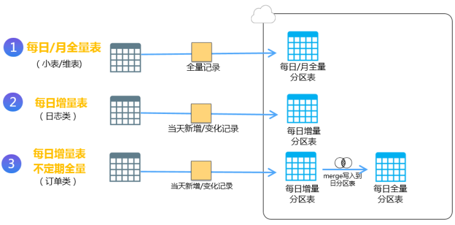

# 数据抽取

## 全量抽取
全量抽取是将数据源中的表或视图的数据原封不动的从数据库中抽取出来，并写入到Hive、MaxCompute等大数据平台中，有点类似于业务库之间的数据迁移。

全量同步比较简单，常用于小数据量的离线同步场景。不过这种同步方法，也有两个弊端，与增量离线同步一模一样：
+ 只能获取最新的状态
+ 会丢失已经被delete的记录

## 增量抽取
用时间戳方式抽取增量数据很常见，业务系统在源表上新增一个时间戳字段，创建、修改表记录时，同时修改时间戳字段的值。 抽取任务运行时，进行全表扫描，通过比较抽取任务的业务时间、时间戳字段来决定抽取哪些数据。

此种数据同步方式，在准确率方面有两个弊端：
+ 只能获取最新的状态，无法捕获过程变更信息，比如电商购物场景，如果客户下单后很快支付，隔天抽取增量数据时，只能获取最新的支付状态，下单时的状态有可能已经丢失。针对此种问题，需要根据业务需求来综合判定是否需要回溯状态。
+ 会丢失已经被delete的记录。如果在业务系统中，将记录物理删除。也就无法进行增量抽取。一般情况下，要求业务系统不删除记录，只对记录进行打标。

## 拉链抽取
所谓拉链，就是记录历史
+ 记录一个事物从开始，一直到当前状态的所有变化的信息。
+ 我们可以使用这张表拿到最新的当天的最新数据以及之前的历史数据。
+ 既能满足反应数据的历史状态，又可以最大限度地节省存储空间

### MySQL binlog
解析binlog日志，给数据同步带来了新的方法，将解析之后结果发送到Hive/MaxCompute等大数据平台，实现秒级延时的数据同步。

解析binlog日志增量同步方式技术很先进，有3个非常大的优点：
1.数据延时小。在阿里巴巴双11场景，在巨大的数据量之下，可以做到秒级延时;
2.不丢失数据，可以捕获数据delete的情形；
3.对业务表无额外要求，可以缺少时间戳字段；

### Oracle Redo Log
Oracle是功能非常强大的数据库，通过Oracle GoldenGate实时解析Redo Log日志，并将解析后的结果发布到指定的系统

## 数据抽取架构

